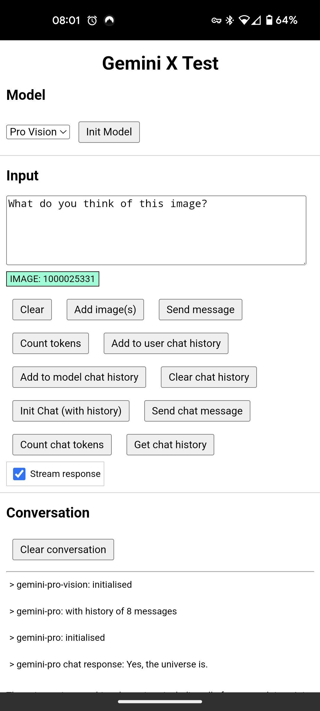
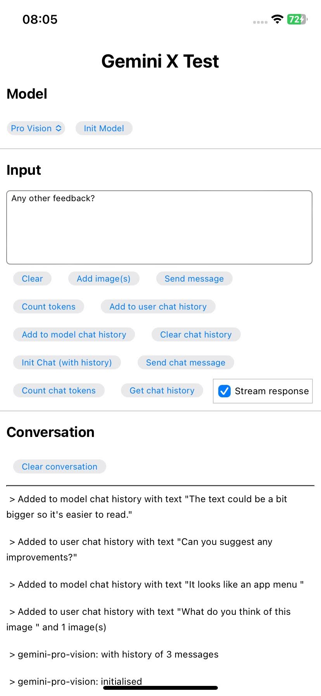

cordova-plugin-gemini-x example project
==============================================

This repo contains an example Cordova app project which illustrates the use of [cordova-plugin-gemini-x](https://github.com/dpa99c/cordova-plugin-gemini-x) which provides a Cordova plugin for the native Google Gemini AI SDKs for [Android](https://ai.google.dev/tutorials/android_quickstart) and [iOS](https://ai.google.dev/tutorials/swift_quickstart).

| Android | iOS |
|  |  |


<!-- START doctoc generated TOC please keep comment here to allow auto update -->
<!-- DON'T EDIT THIS SECTION, INSTEAD RE-RUN doctoc TO UPDATE -->
**Table of Contents**

- [Downloading](#downloading)
- [Configuring](#configuring)
  - [iOS](#ios)
- [Building and running](#building-and-running)
- [Available regions](#available-regions)
- [Using the example app](#using-the-example-app)
  - [Simple interactions](#simple-interactions)
    - [Simple text-only interactions](#simple-text-only-interactions)
    - [Simple multi-modal interactions](#simple-multi-modal-interactions)
  - [Streaming interactions](#streaming-interactions)
    - [Streaming text-only interactions](#streaming-text-only-interactions)
    - [Streaming multi-modal interactions](#streaming-multi-modal-interactions)
  - [Multi-turn (chat) conversations](#multi-turn-chat-conversations)
    - [Text-only conversation](#text-only-conversation)
    - [Text-only conversation with pre-defined history](#text-only-conversation-with-pre-defined-history)
    - [Multi-modal conversation with streaming response](#multi-modal-conversation-with-streaming-response)
    - [Multi-modal conversation](#multi-modal-conversation)
- [License](#license)

<!-- END doctoc generated TOC please keep comment here to allow auto update -->

# Downloading

To download the example project, clone it using git:

    $ git clone https://github.com/dpa99c/cordova-plugin-gemini-x-example.git && cd cordova-plugin-gemini-x-example

# Configuring
Set your Gemini API key in `www/index.html`:
```javascript
GEMINI_API_KEY = "YOUR_API_KEY";
```

Install the Android and/or iOS platforms into the project
- `$ cordova platform add android`
- `$ cordova platform add ios`

## iOS
The Gemini SDK is not currently available via Cocoapods and Cordova doesn't currently support the Swift Package Manager, so you will need to manually add the SDK to your project.
To add the SDK to your project, follow [these instructions](https://ai.google.dev/tutorials/swift_quickstart#add-sdk).

# Building and running

- Build and run the project:
- `$ cordova run android`
- `$ cordova run ios`

# Available regions
Currently Gemini is not available in all regions (mainly UK and EU).
The list of currently supported regions is here: https://ai.google.dev/available_regions#available_regions

To bypass the region restriction, use a VPN on the device to connect to a supported region (such as the US) before running the app.

# Using the example app
The example app is a simple Cordova app which demonstrates the use of the Gemini plugin.

## Simple interactions
The most basic interaction with the Gemini model is to send a text or text+images message to the model and receive a text response when the model has processed the message.

### Simple text-only interactions
- Select the "Pro" model for text-only interactions, then press "Init Model".
- Type some text into the text box to send to the Gemini model.
- Press "Send message" to send the text to the Gemini model. 
- Your message will be displayed in the "Conversation" section.
- When the model has processed the message, the model response will be displayed in the "Conversation" section.

### Simple multi-modal interactions
- Select "Pro Vision" for text and image interactions, then press "Init Model".
- Press the "Add image(s)" button to select one or more images from the device's photo library to send to the Gemini model.
- Type some text into the text box to send to the Gemini model.
- Press "Send message" to send the text and image(s) to the Gemini model. 
- Your message will be displayed in the "Conversation" section.
- When the model has processed the message, the model response will be displayed in the "Conversation" section.

## Streaming interactions
The Gemini model can also be interacted with via a streaming interface, which allows the app to send a message to the model and receive a response in real-time as the model processes the message.

### Streaming text-only interactions

- Select the "Pro" model for text-only interactions, then press "Init Model".
- Check the "Stream response" checkbox.
- Type some text into the text box to send to the Gemini model.
- Press "Send message" to send the text to the Gemini model. 
- Your message will be displayed in the "Conversation" section.
- As the model processes the message, the response fragments will be displayed in grey in the "Conversation" section.
- When the model has processed the message, the final model response will be displayed in black.

### Streaming multi-modal interactions
- Select "Pro Vision" for text and image interactions, then press "Init Model".
- Check the "Stream response" checkbox.
- Press the "Add image(s)" button to select one or more images from the device's photo library to send to the Gemini model.
  - Attached images will be listed by filename below the text box.
  - To remove an image, tap on the image filename in the list.
- Type some text into the text box to send to the Gemini model.
- Press "Send message" to send the text and image(s) to the Gemini model.
- Your message will be displayed in the "Conversation" section.
- As the model processes the message, the response fragments will be displayed in grey in the "Conversation" section.
- When the model has processed the message, the final model response will be displayed in black.

## Multi-turn (chat) conversations
The Gemini model can also be interacted with via a multi-turn conversation interface, which allows the user to have a freeform conversation with the model and the model response will be contextual to the entire conversation history.

### Text-only conversation
- Select the "Pro" model for text-only interactions, then press "Init Model".
- Press "Init Chat (with history)" to initialise the chat (with an empty chat history).
- Type some text into the text box to send to the Gemini model.
- Press "Send message" to send the text to the Gemini model.
- Your message will be displayed in the "Conversation" section.
- When the model has processed the message, the model response will be displayed in the "Conversation" section.
- Type some more text into the text box to send to the Gemini model.
- Press "Send message" to send the text to the Gemini model.
- Your message will be displayed in the "Conversation" section.
- When the model has processed the message, the model response will be displayed in the "Conversation" section.

### Text-only conversation with pre-defined history
- Select the "Pro" model for text-only interactions, then press "Init Model".
- Type some text into the text box that represents the first message in the conversation from the user to the Gemini model.
- Press "Add to user chat history" to add the message to chat history.
- Type some text into the text box that represents the first response in the conversation from the Gemini model to the user.
- Press "Add to model chat history" to add the message to chat history.
- Press "Init Chat (with history)" to initialise the chat with the chat history.
- Type some text into the text box to send to the Gemini model.
- Press "Send message" to send the text to the Gemini model.
- Your message will be displayed in the "Conversation" section.
- When the model has processed the message, the model response will be displayed in the "Conversation" section.
- Type some more text into the text box to send to the Gemini model.
- Press "Send message" to send the text to the Gemini model.
- Your message will be displayed in the "Conversation" section.
- When the model has processed the message, the model response will be displayed in the "Conversation" section.

### Multi-modal conversation with streaming response
The Gemini SDK supports streaming responses for multi-modal conversations. This allows the app to send a message to the model and receive a response in real-time as the model processes the message.

- Select the "Pro" model for text-only interactions, then press "Init Model".
- Check the "Stream response" checkbox.
- Press "Init Chat (with history)" to initialise the chat (with an empty chat history).
- Type some text into the text box to send to the Gemini model.
- Press "Send message" to send the text to the Gemini model.
- Your message will be displayed in the "Conversation" section.
- As the model processes the message, the response fragments will be displayed in grey in the "Conversation" section.
- When the model has processed the message, the final model response will be displayed in black.

### Multi-modal conversation
The Gemini Pro Vision model does not yet support multi-turn conversations with images.

# License
================
The MIT License

Copyright (c) 2024 Dave Alden / Working Edge Ltd.

Permission is hereby granted, free of charge, to any person obtaining a copy
of this software and associated documentation files (the "Software"), to deal
in the Software without restriction, including without limitation the rights
to use, copy, modify, merge, publish, distribute, sublicense, and/or sell
copies of the Software, and to permit persons to whom the Software is
furnished to do so, subject to the following conditions:

The above copyright notice and this permission notice shall be included in
all copies or substantial portions of the Software.

THE SOFTWARE IS PROVIDED "AS IS", WITHOUT WARRANTY OF ANY KIND, EXPRESS OR
IMPLIED, INCLUDING BUT NOT LIMITED TO THE WARRANTIES OF MERCHANTABILITY,
FITNESS FOR A PARTICULAR PURPOSE AND NONINFRINGEMENT. IN NO EVENT SHALL THE
AUTHORS OR COPYRIGHT HOLDERS BE LIABLE FOR ANY CLAIM, DAMAGES OR OTHER
LIABILITY, WHETHER IN AN ACTION OF CONTRACT, TORT OR OTHERWISE, ARISING FROM,
OUT OF OR IN CONNECTION WITH THE SOFTWARE OR THE USE OR OTHER DEALINGS IN
THE SOFTWARE.
